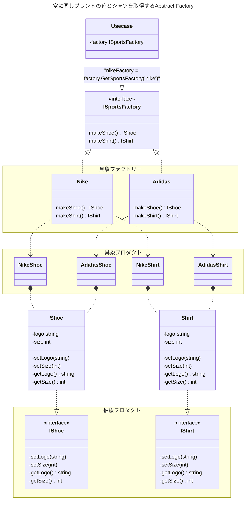

# Abstract Factory

- Abstract Factoryパターンは、**生成に関するパターン**である。
- **生成に関するパターン**は、柔軟性を増し、コードの再利用を促すようなコードの仕組みを提供する。
- Abstract Factoryパターンは、関連したオブジェクトの集まりを、具象クラスを指定することなく生成できる。
- つまり、クライアント側は、具体的なクラスを指定する必要はなく、「なんとなくこれが欲しい」というふわっとした粒度でオブジェクトの生成を依頼することができる。具体的に「どう」生成するかは、Abstract Factoryパターンの実装のなかで決められるということだ。

