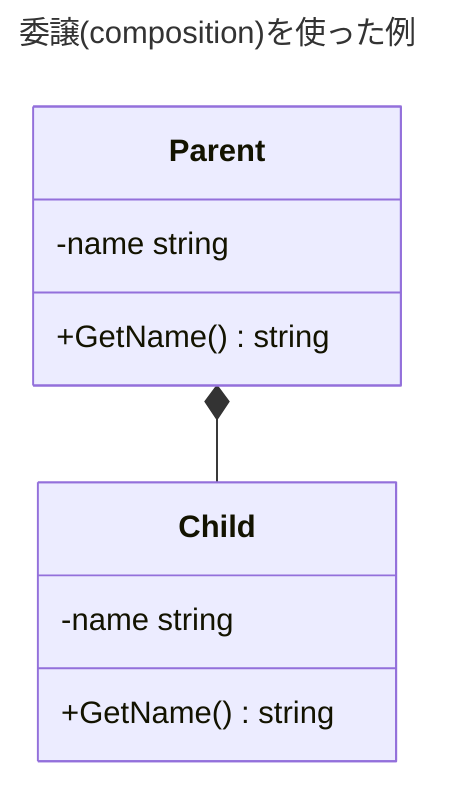

# 委譲を使ったクラス図

```mermaid
---
title: 委譲(composition)を使った例
---

classDiagram
    class Parent {
        -name string
        +GetName() string
    }
    class Child {
        -name string
        +GetName() string
    }

    Parent *-- Child
```