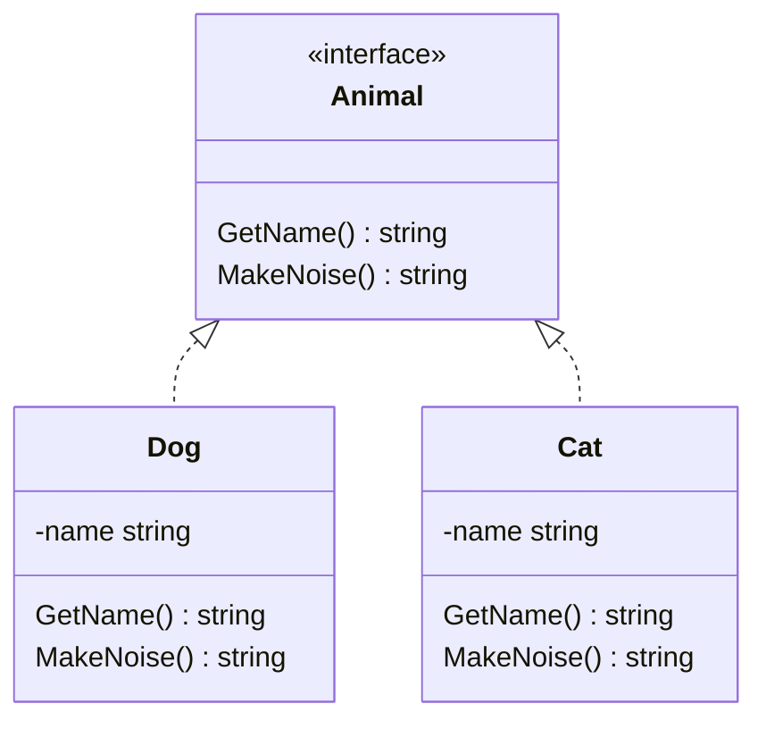

# インターフェースを使ったクラス図

- Animal は抽象クラス（インターフェース）で、それを実現（実装、満たす）するクラスが、具象クラスのDog, Cat

```mermaid
classDiagram
    class Animal {
        <<interface>>
        GetName() string
        MakeNoise() string
    }

    class Dog {
        -name string

        GetName() string
        MakeNoise() string
    }

    class Cat {
        -name string

        GetName() string
        MakeNoise() string
    }

    Animal <|.. Dog
    Animal <|.. Cat
```